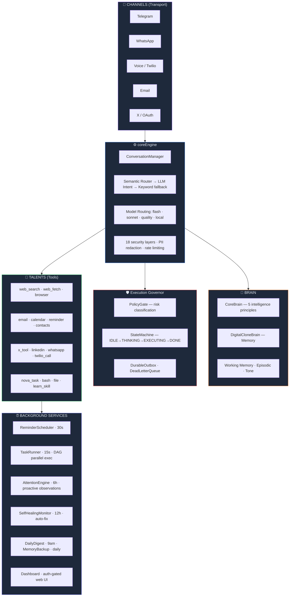

<div align="center">

<a href="https://github.com/AmplifyCo/novabot">
  
</a>

**Nova handles your emails, calls, social posts, and research while you focus on building.**

Self-hosted. Open source. Your data never leaves your server.

[](https://www.python.org/downloads/)
[](LICENSE)
[](https://lancedb.com/)
[](https://t.me/BotFather)
[](https://litellm.ai/)

</div>

---

## What Nova Does For You

**📬 Acts on your behalf**
Sends emails, posts to X and LinkedIn, makes phone calls, books calendar events, and follows up with contacts. Nova takes action. You just ask.

**🧠 Learns who you are**
Your voice, contacts, preferences, and working style. The more you use it, the more Nova thinks and writes like you.

**🔐 Stays on your server**
Zero third-party data sharing. No monthly SaaS fee. You own the infrastructure, the data, and every line of code.

---

## How It Works

1. **Set up in minutes.** Clone the repo, add your API keys, run one command.
2. **Connect your tools.** Link email, calendar, Telegram, X, LinkedIn, and your phone number.
3. **Just tell Nova what you need.** Message it on Telegram like a trusted assistant. It acts and reports back.

---

## Built for Solo Founders

You are wearing every hat. Nova gives you leverage without adding headcount.

- Drafts and sends cold emails while you sleep
- Researches competitors and delivers a briefing before your first meeting
- Posts to X and LinkedIn from a single message to Nova
- Remembers every contact, follow-up, and unfinished thread so you never drop the ball

---

✅ **Open source (MIT)** &nbsp; ✅ **Self-hosted on your server** &nbsp; ✅ **No subscription fees** &nbsp; ✅ **Read every line of code**

---

> Want to self-host or contribute? Full technical documentation below.

---

Nova is a fully autonomous Non-Human Assistant you run on your own server. It connects to you via Telegram (and optionally voice, email, WhatsApp, and X), builds a persistent memory of who you are, and can take real-world actions on your behalf — from writing emails to making phone calls to researching the web.

Unlike SaaS assistants, Nova runs entirely on infrastructure you own. Your data stays on your server.

---

## 🎯 Nova's Purpose

> *Nova exists to be the proactive half of your intelligence — noticing what you'd notice if you had infinite time, acting on what needs doing before you ask, and learning enough about you to anticipate rather than just respond.*

Nova's purpose drives five proactive behaviors, all within security guardrails:

| Drive | When | What Nova does |
|---|---|---|
| ☀️ **Morning briefing** | 7:30–9am daily | Today's agenda, upcoming events, time-sensitive follow-ups |
| 🌙 **Evening summary** | 7–9pm daily | What was accomplished, what's pending for tomorrow |
| 📅 **Weekly look-ahead** | Sunday 6pm | 7-day horizon: deadlines, events, preparation suggestions |
| 🔍 **Curiosity scan** | Every 6h (waking hours) | Unresolved items, patterns, connections worth surfacing |
| 💡 **Spontaneous interest** | Any scan | Surfaces unexpected observations without being asked |

These drives are defined in `brain/nova_purpose.py` and executed by `brain/attention_engine.py`.

---

## 🛠️ What Nova Can Do

| Capability | Details |
|---|---|
| 💬 **Conversations** | Natural chat via Telegram with full memory of past interactions |
| 📧 **Email** | Read inbox, compose replies, send — on your behalf via IMAP/SMTP |
| 📅 **Calendar** | Create, check, and manage events via CalDAV |
| 🌐 **Web Research** | Real-time search via Tavily (AI-optimised) with DuckDuckGo fallback |
| 🖥️ **Web Browsing** | Load any URL with visual verification (Playwright + Chromium) |
| 📱 **Social Media** | Post to X (Twitter) and LinkedIn via OAuth |
| 📞 **Voice Calls** | Make and receive phone calls via Twilio — with ElevenLabs natural voice |
| 💬 **WhatsApp** | Send and receive messages via Twilio WhatsApp |
| ⏰ **Reminders** | Set time-based reminders; Nova notifies you when they fire |
| ⚡ **Background Tasks** | Autonomous multi-step research or actions with dependency-aware parallel execution; full Telegram notification on completion |
| 📄 **File Operations** | Read, write, and manage files on the host |
| 💻 **Shell Commands** | Execute sandboxed bash commands |
| 🧠 **Memory** | Learns your preferences, style, contacts, and conversation history |

---

## 🏗️ Architecture

Nova is built around a biological metaphor — no heavyweight frameworks, pure Python + asyncio.



---

## 🔀 Multi-Provider LLM Routing

Nova routes tasks to the right model automatically — balancing speed, cost, and capability.

| Tier | Providers | Used for |
|---|---|---|
| ⚡ **flash** | Gemini 2.0 Flash → Claude Haiku → Grok | Intent classification, simple tools, reminders |
| 🧠 **sonnet** | Claude Sonnet → Gemini Flash → Grok | Conversation, tool execution, research |
| 🎯 **quality** | Claude Sonnet (retry) → Gemini 2.5 Pro | Email drafting, complex composition |
| 💻 **local** | SmolLM2 via Ollama | Offline fallback when all APIs are down |

All provider calls go through **LiteLLM** — one interface, any provider.

---

## 🧠 Memory System

Nova maintains a layered memory architecture backed by **LanceDB** (vector store):

| Memory Type | What's Stored | Scope |
|---|---|---|
| 💭 **Working Memory** | Tone, urgency, unfinished items, pending action confirmations | Per session (JSON) |
| 🎬 **Episodic Memory** | Action outcomes — what worked, what failed | Persistent (LanceDB) |
| 💬 **Conversation Memory** | Full history per channel and user | Persistent (LanceDB) |
| ⚙️ **Preferences** | Learned facts about you — style, habits | Persistent (LanceDB) |
| 👥 **Contacts** | People you interact with | Persistent (LanceDB) |
| 🪪 **Identity** | Bot's core identity and principles | Persistent (LanceDB) |

Third-party content (emails from others) is **summarised before storage**, never stored verbatim. Financial and health data is filtered out at ingestion.

---

## 🤖 AGI Capabilities

| Capability | File | What it does |
|---|---|---|
| 🎵 **Tone Analyzer** | `brain/tone_analyzer.py` | Detects 5 tone registers in real-time, zero-latency |
| 💭 **Working Memory** | `brain/working_memory.py` | Tracks momentum, urgency, conversation state, and pending action confirmations |
| 🎬 **Episodic Memory** | `brain/episodic_memory.py` | Records event-outcome pairs; tracks per-tool success rates |
| 🌟 **Purpose** | `brain/nova_purpose.py` | Nova's soul — 5 drives (morning, evening, weekly, curiosity, spontaneous) shape all proactive behavior |
| 👁️ **Attention Engine** | `brain/attention_engine.py` | Purpose-driven proactive observations every 6h (morning brief, evening summary, curiosity scan) |
| 🧩 **Goal Decomposer** | `core/goal_decomposer.py` | Breaks complex goals into 3–7 subtasks with explicit `depends_on` for parallel execution |
| ⚡ **Task Runner** | `core/task_runner.py` | DAG-based parallel execution; notifies Telegram on each step and on completion |
| 🔍 **Critic Agent** | `brain/critic_agent.py` | Validates task output quality (score ≥ 0.75 to pass); triggers one LLM refinement pass if below threshold; fail-open |
| 📚 **Reasoning Templates** | `brain/reasoning_template_library.py` | Stores successful goal→subtask decompositions in LanceDB; GoalDecomposer queries before each new task to reuse proven patterns |
| ✅ **Pending Action Confirmation** | `brain/working_memory.py` + `conversation_manager.py` | Stores proposed actions ("shall I post this?") and executes on user confirmation ("yes") — fixes the re-draft loop |
| 📊 **Intent Collector** | `brain/intent_data_collector.py` | Captures live intent labels as training data for future model fine-tuning |

---

## 📋 Intelligent Delegation (Google DeepMind Framework)

Nova implements the key principles from the *Intelligent AI Delegation* research paper, giving autonomous background tasks the same trust properties as human-delegated work.

<details>
<summary>View all 10 delegation principles</summary>

| Principle | What's implemented |
|---|---|
| 📝 **Contract-first decomposition** | Every subtask has a `verification_criteria` — a one-sentence success test written before execution begins |
| 🔄 **Reversibility classification** | `reversible: bool` on each subtask; irreversible steps (send email, post to X) show a Telegram warning with a 10-second cancel window |
| 🔀 **Adaptive re-delegation** | When a subtask exhausts all retries, Gemini Flash proposes an alternative approach and tries once more |
| 📊 **Tool performance awareness** | EpisodicMemory tracks per-tool success rates; GoalDecomposer uses this to prefer reliable tools and flag flaky ones |
| ⚡ **Dynamic cognitive friction** | High-risk background tasks surface a risk note in the confirmation message so you're informed before queuing |
| 🗂️ **Delegation audit trail** | Every task produces `{task_id}_audit.json` with per-step metadata: tool used, tokens, success, re-delegated flag |
| 🔑 **Just-in-time tool access** | Each subtask only exposes its declared tools to the agent — a web-search step cannot accidentally call email |
| 🔐 **Continuous authorization** | Task DB status is re-read before every subtask; "stop task" cancels immediately, not just between tasks |
| 🎯 **Multi-dimensional routing** | 4-signal delegation score (tool variety, reversibility, complexity keywords, scope) catches complex tasks the LLM might under-label |
| 💰 **Task budget enforcement** | Hard limits: 200k cumulative tokens or 30 minutes wall time per task; partial results delivered if either is hit |

</details>

---

## ⚡ Parallel Background Execution

When Nova decomposes a background task, it builds a **dependency graph** (not a flat list). Independent steps run concurrently; dependent steps wait for their predecessors.

```
Goal: "Research AI funding trends and write a summary"

GoalDecomposer output:
  Step 0: Search Tavily for AI funding 2025         depends_on: []
  Step 1: Search X for AI funding posts             depends_on: [0]  ┐
  Step 2: Fetch TechCrunch AI funding article       depends_on: [0]  ├─ parallel wave
  Step 3: Fetch Crunchbase AI report                depends_on: [0]  ┘
  Step 4: Compile findings → data/tasks/{id}.txt    depends_on: [1,2,3]

Execution:
  Wave 0: Step 0  (sequential — primes the search)
  Wave 1: Steps 1, 2, 3  (asyncio.gather — run simultaneously)
  Wave 2: Step 4  (waits for all three to finish)
```

Each wave runs via `asyncio.gather()`. Steps 1–3 execute concurrently, cutting wall time roughly 3×.

---

## 🔒 Security

Nova applies **18 defence layers** to every message.

<details>
<summary>View all 18 security layers</summary>

1. 🚦 Rate limiting per user
2. 🧹 Input sanitization (length, encoding)
3. 🛡️ Prompt injection detection (LLM Security Guard)
4. 🕵️ PII redaction (phone, email, SSN, IBAN, routing numbers)
5. 🏷️ Trust-tier enforcement (owner vs. untrusted callers)
6. 🚧 Policy Gate (read / write / irreversible risk classification)
7. 📬 Durable Outbox (deduplication — no double sends)
8. 🔍 Tool output injection guard
9. ✅ Semantic relevance validation (distance thresholds on all vector searches)
10. 🧽 Output filtering (strip credentials, XML artefacts)
11. 🚫 Bash command blocklist (rm -rf, sudo, reverse shells, encoding bypasses)
12. ⚡ Circuit breaker (3 API failures → 2-minute cooldown)
13. ☠️ Dead Letter Queue (poison events → Telegram alert after 3 retries)
14. 🌐 SSRF protection (blocks private/internal network access from web tools)
15. 📂 Directory confinement (file writes restricted to project root + /tmp)
16. 🔐 Fail-closed channels (WhatsApp/Voice reject all if allow-list not configured)
17. 🔑 Timing-safe auth (HMAC constant-time comparison for API keys)
18. ☢️ Per-user state isolation (no cross-user context leakage)

</details>

Risk and supervision are formally documented in [`RISKS.md`](../RISKS.md) and [`SUPERVISION.md`](../SUPERVISION.md).

---

## 🚀 Getting Started

### Prerequisites

- Python 3.10+
- At least one LLM provider API key (Claude, Gemini, or Grok)
- Telegram Bot Token — [create one via BotFather](https://t.me/BotFather)

### Installation

```bash
git clone https://github.com/AmplifyCo/novabot.git
cd novabot

python -m venv venv
source venv/bin/activate

pip install -r requirements.txt
```

### Configuration

Copy the example env file and fill in your values:

```bash
cp .env.example .env
nano .env
```

**Required:**
```bash
# Identity
BOT_NAME=Nova
OWNER_NAME=YourName

# At least one LLM provider
ANTHROPIC_API_KEY=sk-ant-...      # Claude (Sonnet, Haiku, Opus)
GEMINI_API_KEY=AIza...            # Gemini Flash / Pro
GROK_API_KEY=xai-...             # Grok (optional, used as last-resort fallback)

# Telegram (required)
TELEGRAM_BOT_TOKEN=your_bot_token
TELEGRAM_CHAT_ID=your_chat_id
```

**Search (recommended):**
```bash
TAVILY_API_KEY=tvly-...           # Free at tavily.com — 1000 searches/month
```

**Optional capabilities:**
```bash
# Email
GMAIL_EMAIL=you@gmail.com
GMAIL_APP_PASSWORD=xxxx

# Voice calls (Twilio)
TWILIO_ACCOUNT_SID=ACxxx
TWILIO_AUTH_TOKEN=xxx
TWILIO_PHONE_NUMBER=+1...
ELEVENLABS_API_KEY=xxx            # Natural voice (optional; falls back to Google TTS)

# WhatsApp
TWILIO_WHATSAPP_NUMBER=whatsapp:+1...

# Social Media
X_API_KEY=xxx
X_API_SECRET=xxx
LINKEDIN_CLIENT_ID=xxx
LINKEDIN_CLIENT_SECRET=xxx
```

### Run

```bash
python src/main.py
```

Nova starts and connects to Telegram. Send it a message to begin.

---

<details>
<summary><h2>☁️ Deployment (EC2 / Amazon Linux)</h2></summary>

```bash
# SSH in
ssh -i your-key.pem ec2-user@your-instance-ip

# Clone and install
git clone https://github.com/AmplifyCo/novabot.git
cd novabot
pip install -r requirements.txt

# Configure
nano .env

# Run as a systemd service
sudo systemctl start novabot
sudo systemctl enable novabot
```

### Optional: Full browser support

```bash
sudo dnf install -y xorg-x11-server-Xvfb atk at-spi2-atk
pip install playwright
playwright install --with-deps chromium
```

### Update

```bash
git pull
pip install -r requirements.txt   # pick up any new dependencies
sudo systemctl restart novabot
```

---

## 🍎 Deployment (Mac / macOS)

No code changes are needed — Nova runs natively on macOS (Apple Silicon and Intel).

### Install

```bash
git clone https://github.com/AmplifyCo/novabot.git
cd novabot

python3 -m venv venv
source venv/bin/activate

pip install -r requirements.txt

# Browser support — no extra system packages needed on Mac
playwright install chromium
```

### Configure

```bash
cp .env.example .env
nano .env          # fill in your API keys
```

### Run (foreground — for testing)

```bash
source venv/bin/activate
python src/main.py
```

### Run as a background service (launchd)

`launchd` is the Mac equivalent of `systemd`. It keeps Nova alive across reboots automatically.

**Step 1 — Create a startup wrapper script**

launchd doesn't source `.env` files, so use a small shell script that loads it first:

```bash
cat > ~/novabot/start_nova.sh << 'EOF'
#!/bin/bash
set -a
source "$(dirname "$0")/.env"
set +a
exec "$(dirname "$0")/venv/bin/python" "$(dirname "$0")/src/main.py"
EOF

chmod +x ~/novabot/start_nova.sh
```

**Step 2 — Create the launchd plist**

Replace `YOUR_USERNAME` with the output of `whoami` and adjust the path if you cloned elsewhere:

```bash
mkdir -p ~/novabot/logs

cat > ~/Library/LaunchAgents/com.nova.digitalclone.plist << 'EOF'
<?xml version="1.0" encoding="UTF-8"?>
<!DOCTYPE plist PUBLIC "-//Apple//DTD PLIST 1.0//EN"
  "http://www.apple.com/DTDs/PropertyList-1.0.dtd">
<plist version="1.0">
<dict>
    <key>Label</key>
    <string>com.nova.digitalclone</string>

    <key>ProgramArguments</key>
    <array>
        <string>/Users/YOUR_USERNAME/novabot/start_nova.sh</string>
    </array>

    <key>WorkingDirectory</key>
    <string>/Users/YOUR_USERNAME/novabot</string>

    <!-- Start automatically on login -->
    <key>RunAtLoad</key>
    <true/>

    <!-- Restart automatically if it crashes -->
    <key>KeepAlive</key>
    <true/>

    <!-- Wait 10s before restarting after a crash -->
    <key>ThrottleInterval</key>
    <integer>10</integer>

    <key>StandardOutPath</key>
    <string>/Users/YOUR_USERNAME/novabot/logs/nova.log</string>

    <key>StandardErrorPath</key>
    <string>/Users/YOUR_USERNAME/novabot/logs/nova_error.log</string>
</dict>
</plist>
EOF
```

**Step 3 — Load the service**

```bash
launchctl load ~/Library/LaunchAgents/com.nova.digitalclone.plist
```

Nova is now running and will restart automatically on login or if it crashes.

### Mac service cheat sheet

| Task | Mac (launchctl) | Linux (systemctl) |
|---|---|---|
| **Start** | `launchctl load ~/Library/LaunchAgents/com.nova.digitalclone.plist` | `sudo systemctl start novabot` |
| **Stop** | `launchctl unload ~/Library/LaunchAgents/com.nova.digitalclone.plist` | `sudo systemctl stop novabot` |
| **Restart** | `launchctl kickstart -k gui/$(id -u)/com.nova.digitalclone` | `sudo systemctl restart novabot` |
| **Status** | `launchctl list \| grep nova` | `sudo systemctl status novabot` |
| **Enable on boot** | `RunAtLoad: true` in plist (already set above) | `sudo systemctl enable novabot` |
| **Logs (live)** | `tail -f ~/novabot/logs/nova.log` | `journalctl -u novabot -f` |

### Update on Mac

```bash
cd ~/novabot
git pull
source venv/bin/activate
pip install -r requirements.txt

# Restart Nova
launchctl kickstart -k gui/$(id -u)/com.nova.digitalclone
```

### Uninstall the service

```bash
launchctl unload ~/Library/LaunchAgents/com.nova.digitalclone.plist
rm ~/Library/LaunchAgents/com.nova.digitalclone.plist
```

</details>

---

## 🧰 Tech Stack

| Layer | Technology |
|---|---|
| 🤖 **LLM providers** | Claude (Anthropic) · Gemini (Google) · Grok (xAI) via LiteLLM |
| 💻 **Local fallback** | SmolLM2 via Ollama |
| 🗄️ **Vector store** | LanceDB (ACID-compliant, crash-safe, embedded) |
| 🔢 **Embeddings** | all-MiniLM-L6-v2 (sentence-transformers) |
| 🔍 **Web search** | Tavily API (primary) · DuckDuckGo (fallback) |
| 📡 **Transport** | python-telegram-bot · Twilio (voice + WhatsApp) |
| 🌐 **Web framework** | FastAPI + uvicorn (dashboard + webhooks) |
| ⚙️ **Concurrency** | asyncio (event loop, gather, semaphores, per-user locks) |
| 💾 **Persistence** | LanceDB (vectors) · SQLite (task queue) · JSON (reminders, outbox) |
| 🖥️ **Deployment** | EC2 · systemd · public HTTPS endpoint |

---

## 🔄 Data Flow Examples

<details>
<summary><b>"Find the top Thai restaurants in Fremont, CA"</b> — inline action</summary>

```
1. Telegram → Heart
   Intent: action | confidence: high | tools: web_search | background: no

2. Heart → Agent (flash tier — single tool, runs inline)

3. Agent → web_search("top Thai restaurants Fremont CA")
   → Tavily returns 5 results with addresses, ratings, summaries

4. Agent synthesises → response to user

5. Heart → store_conversation_turn() → LanceDB
6. Heart → IntentDataCollector.record("Thai restaurants...", "action", 0.9)
   → data/intent_training/samples.jsonl (training data for future fine-tuning)
```

</details>

<details>
<summary><b>"Research AI funding trends and write me a summary"</b> — background task</summary>

```
1. Telegram → Heart
   delegation_score: 0.80 (3 tools + complexity keywords) → background: yes

2. Heart → enqueue background task → "Got it, I'll notify you when done"

3. TaskRunner picks up → GoalDecomposer → 5 subtasks with depends_on graph:
   · Step 0: Initial Tavily search (wave 0)
   · Steps 1,2,3: Fetch 3 articles in parallel (wave 1 — asyncio.gather)
   · Step 4: Compile + write data/tasks/{id}.txt (wave 2)

4. Before each wave: re-check task status (continuous authorization)
   Before irreversible steps: Telegram warning + 10s cancel window

5. TaskRunner completes → reads file → sends full content to Telegram in chunks
6. Audit saved: data/tasks/{id}_audit.json (per-step tokens, timing, success)
```

</details>

<details>
<summary><b>"Draft a tweet about our product launch" → "yes"</b> — pending action confirmation</summary>

```
1. Telegram → Heart
   Intent: action | tools: x_tool | background: no

2. Heart → Agent (sonnet tier — composition + tool)

3. Agent drafts tweet but doesn't post (high-stakes → confirm first)
   → Response: "Here's a draft: '...' — shall I post it?"

4. Heart → _detect_and_store_proposal()
   → Pending action stored in WorkingMemory: {tool: x_tool, label: "post tweet"}

5. User replies: "yes"

6. Heart → _handle_pending_action_confirmation() [EARLY EXIT — skips intent routing]
   → Pops pending action → Agent executes x_tool with stored parameters
   → Response: "Posted! Here's the link: ..."
```

</details>

---

## 📁 Project Structure

<details>
<summary>View full project tree</summary>

```
novabot/
├── src/
│   ├── core/
│   │   ├── conversation_manager.py        # Heart — intent routing, model selection, delegation scoring
│   │   ├── agent.py                       # AutonomousAgent — ReAct loop with per-run token tracking
│   │   ├── context_thalamus.py            # Token budgeting + history pruning
│   │   ├── memory_consolidator.py         # Prunes stale conversation turns (6h)
│   │   ├── scheduler.py                   # Background task scheduler
│   │   ├── task_queue.py                  # SQLite-backed task + subtask persistence
│   │   ├── task_runner.py                 # DAG-based parallel executor with budget enforcement
│   │   ├── goal_decomposer.py             # LLM-based decomposition with depends_on graph
│   │   ├── config.py                      # Configuration loader
│   │   ├── timezone.py                    # Timezone utilities
│   │   ├── brain/
│   │   │   ├── core_brain.py              # Intelligence principles (how to think)
│   │   │   ├── digital_clone_brain.py     # Memory (what Nova knows about you)
│   │   │   ├── working_memory.py          # Per-session tone + state
│   │   │   ├── episodic_memory.py         # Event-outcome history + per-tool success rates
│   │   │   ├── nova_purpose.py            # Purpose drives: morning, evening, weekly, curiosity
│   │   │   ├── attention_engine.py        # Purpose-driven proactive observations
│   │   │   ├── tone_analyzer.py           # Real-time tone detection
│   │   │   ├── semantic_router.py         # Fast-path intent matching
│   │   │   ├── intent_data_collector.py   # Training data capture (JSONL)
│   │   │   ├── critic_agent.py            # Validates task output; triggers LLM refinement
│   │   │   ├── reasoning_template_library.py  # Stores + reuses successful decompositions
│   │   │   └── vector_db.py               # LanceDB wrapper (shared by all brain components)
│   │   ├── tools/
│   │   │   ├── search.py                  # Tavily + DuckDuckGo web search
│   │   │   ├── web.py                     # Direct URL fetch
│   │   │   ├── browser.py                 # Playwright headless browser
│   │   │   ├── email.py                   # IMAP/SMTP
│   │   │   ├── calendar.py                # CalDAV
│   │   │   ├── x_tool.py                  # X / Twitter
│   │   │   ├── linkedin.py                # LinkedIn
│   │   │   ├── twilio_call.py             # Outbound voice calls
│   │   │   ├── reminder.py                # Scheduled reminders
│   │   │   ├── contacts.py                # Contact management
│   │   │   ├── nova_task_tool.py          # Background task queue interface
│   │   │   ├── bash.py                    # Sandboxed shell commands
│   │   │   ├── file.py                    # File read/write operations
│   │   │   ├── clock.py                   # Current time
│   │   │   └── registry.py                # Tool registration + just-in-time scoping
│   │   ├── nervous_system/
│   │   │   ├── execution_governor.py      # Central coordinator
│   │   │   ├── policy_gate.py             # Risk-based permission checks
│   │   │   ├── outbox.py                  # Durable deduplication (no double sends)
│   │   │   ├── dead_letter_queue.py       # Poison event handling + Telegram alerts
│   │   │   └── state_machine.py           # Agent execution states
│   │   ├── self_healing/
│   │   │   ├── monitor.py                 # Error detection + healing loop (12h)
│   │   │   ├── auto_fixer.py              # LLM-generated patches; reports via Telegram
│   │   │   ├── capability_fixer.py        # Learns new tool capabilities on failure
│   │   │   ├── error_detector.py          # Pattern-based error classification
│   │   │   └── response_interceptor.py    # Intercepts + logs capability gaps
│   │   ├── security/
│   │   │   ├── llm_security.py            # Prompt injection detection
│   │   │   └── audit_logger.py            # Immutable action audit log
│   │   ├── spawner/
│   │   │   ├── agent_factory.py           # Creates sub-agent instances
│   │   │   └── orchestrator.py            # Coordinates parallel sub-agents
│   │   └── talents/
│   │       ├── catalog.py                 # Dynamic capability discovery
│   │       └── builder.py                 # Capability composition
│   ├── channels/
│   │   ├── telegram_channel.py            # Telegram transport
│   │   ├── twilio_voice_channel.py        # Voice call handling
│   │   └── twilio_whatsapp_channel.py     # WhatsApp transport
│   ├── integrations/
│   │   ├── anthropic_client.py            # Claude API wrapper
│   │   ├── gemini_client.py               # Gemini via LiteLLM
│   │   ├── grok_client.py                 # Grok (xAI) via LiteLLM
│   │   ├── local_model_client.py          # SmolLM2 / Ollama offline fallback
│   │   └── model_router.py                # Model tier selection
│   ├── utils/
│   │   ├── dashboard.py                   # Auth-gated web UI: chat window + live stats
│   │   ├── daily_digest.py                # Scheduled daily activity summary via Telegram
│   │   ├── memory_backup.py               # Periodic LanceDB snapshot to disk
│   │   ├── telegram_notifier.py           # Standalone Telegram notification helper
│   │   ├── auto_updater.py                # Self-update from git on restart
│   │   └── vulnerability_scanner.py       # Periodic dependency CVE scanning
│   ├── watchdog.py                        # Process health monitor + auto-restart
│   └── main.py                            # Entry point + service wiring
├── data/
│   ├── lancedb/                           # Vector memories (conversations, preferences)
│   ├── intent_training/                   # Intent classification training data (JSONL)
│   ├── tasks/                             # Background task output files + audit JSONs
│   ├── fixes/                             # Self-healing fix diffs + logs
│   └── conversations/                     # Daily conversation logs (JSONL)
├── setup.py                               # Interactive setup wizard
├── RISKS.md                               # Formal risk register
├── SUPERVISION.md                         # Supervision methods documentation
└── requirements.txt
```

</details>

---

## 📄 License

MIT — see [LICENSE](LICENSE) for details.

## ⚠️ Disclaimer

Nova is an autonomous non-human agent with real-world capabilities — it can send emails, post to social media, make phone calls, and execute shell commands. Monitor its behaviour, especially during initial deployment. Review [`RISKS.md`](../RISKS.md) for a full analysis of known risks and mitigations.

---

*Vector memory powered by [LanceDB](https://lancedb.com/) · Search powered by [Tavily](https://tavily.com/)*
